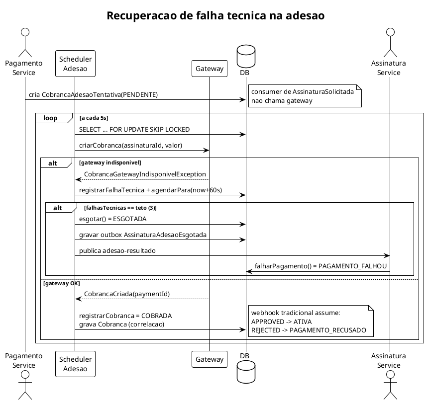

# Recuperacao de Falha Tecnica na Adesao - Plano de Implementacao

> **For agentic workers:** REQUIRED SUB-SKILL: Use superpowers:subagent-driven-development (recommended) or superpowers:executing-plans to implement this plan task-by-task. Steps use checkbox (`- [ ]`) syntax for tracking.

**Goal:** Espelhar o modelo de retentativa da renovacao para a adesao, eliminando o gap que deixa assinaturas presas em `AGUARDANDO_PAGAMENTO` apos falha tecnica do gateway.

**Architecture:** Tabela nova `cobranca_adesao_tentativa` persistida antes da chamada ao gateway. Scheduler `CobrancaAdesaoScheduler` re-cobra com `FOR UPDATE SKIP LOCKED`. Ao esgotar o teto de falhas tecnicas, publica `AssinaturaAdesaoEsgotada` no topico novo `adesao-resultado`. O Assinatura Service consome e move a assinatura para o novo estado terminal `PAGAMENTO_FALHOU`.

**Tech Stack:** Spring Boot 4.1, Java 26, Spring Data JPA, Flyway, Kafka, Postgres, JUnit 5 + AssertJ.

## Global Constraints

- Java 26, Spring Boot 4.1, Google Java Style (indentacao 2 espacos, line length 100).
- Javadoc obrigatorio em todo tipo e metodo publico (primeira frase descritiva, depois `@param`/`@return`/`@throws`, `{@code ...}` para literais).
- Checkstyle 11.0.1 + Spotless google-java-format 1.30.0 (estilo GOOGLE).
- Logging SLF4J Fluent API (`atInfo()`, `atWarn()`, etc.), `event` estavel em snake_case, valores dinamicos via `addKeyValue()`, mensagem curta sem interpolacao. Sem payloads/credenciais/PII.
- CQRS Lite: commands de escrita, leitura via repository.
- Testes JUnit 5 com AssertJ, `@DisplayName` descrevendo comportamento, mensagem contextual `.as(...)`.
- Schema Flyway-owned (`ddl-auto: validate`). Proxima migration Pagamento: `V12`. Assinatura: so codigo (coluna `status` e `VARCHAR`).
- Commits: Conventional Commits, PT-BR, lowercase, sem acento no assunto.
- Comandos: `make lint`, `make format`, `make test`, `make verify` dentro de `services/pagamento` ou `services/assinatura`. Testes de integracao via `make test-integration`.

Referencia: `docs/prd/2026-08-04-recuperacao-falha-tecnica-adesao.md`.

---

## File Structure

### Pagamento Service (`services/pagamento/src/main/java/com/globo/pagamento/`)

**Criar:**
- `adesao/CobrancaAdesaoTentativa.java` — entidade JPA da tentativa de adesao.
- `adesao/StatusTentativaAdesao.java` — enum `PENDENTE | COBRADA | ESGOTADA`.
- `adesao/CobrancaAdesaoTentativaRepository.java` — repo com `buscarProntasParaCobrar` (`FOR UPDATE SKIP LOCKED`).
- `adesao/agendador/CobrancaAdesaoScheduler.java` — scheduler de retentativa.
- `shared/contrato/AssinaturaAdesaoEsgotada.java` — record de contrato do evento.

**Modificar:**
- `adesao/CriarCobrancaAdesao.java` — persistir tentativa `PENDENTE`, nao chamar gateway.
- `shared/kafka/KafkaTopicsConfig.java` — adicionar `adesao-resultado` + `adesao-resultado-dlq`.
- `src/main/resources/application.yaml` — config `app.adesao.*` + rota outbox `AssinaturaAdesaoEsgotada`.
- `src/main/resources/db/migration/V12__cria_tabela_cobranca_adesao_tentativa.sql` — schema.

### Assinatura Service (`services/assinatura/src/main/java/com/globo/assinatura/`)

**Criar:**
- `adesao/FalharPagamentoAdesao.java` — command que transita para `PAGAMENTO_FALHOU`.
- `adesao/evento/AdesaoResultadoConsumer.java` — consumer de `adesao-resultado`.
- `shared/contrato/AssinaturaAdesaoEsgotada.java` — record de contrato (espelho).

**Modificar:**
- `assinatura/StatusAssinatura.java` — adicionar `PAGAMENTO_FALHOU`.
- `assinatura/Assinatura.java` — metodo `falharPagamento()` + ramo em `solicitarCancelamento()`.
- `src/main/resources/application.yaml` — config do topico `app.kafka.topico-adesao-resultado`.

---

## Task 1: Migration e entidade CobrancaAdesaoTentativa (Pagamento)

**Files:**
- Create: `services/pagamento/src/main/resources/db/migration/V12__cria_tabela_cobranca_adesao_tentativa.sql`
- Create: `services/pagamento/src/main/java/com/globo/pagamento/adesao/StatusTentativaAdesao.java`
- Create: `services/pagamento/src/main/java/com/globo/pagamento/adesao/CobrancaAdesaoTentativa.java`
- Test: `services/pagamento/src/test/java/com/globo/pagamento/adesao/CobrancaAdesaoTentativaTest.java`

**Interfaces:**
- Produces: `CobrancaAdesaoTentativa` (entidade), `StatusTentativaAdesao` (enum), metodos `new CobrancaAdesaoTentativa(assinaturaUuid, valor)`, `registrarFalhaTecnica()`, `registrarCobranca(paymentId)`, `esgotouFalhasTecnicas(teto)`, `esgotar()`, `agendarPara(instante)`, getters `getAssinaturaUuid()`, `getValor()`, `getPaymentId()`, `getStatus()`, `getFalhasTecnicas()`, `getProximaTentativaEm()`.

- [ ] **Step 1: Escrever a migration**

```sql
-- services/pagamento/src/main/resources/db/migration/V12__cria_tabela_cobranca_adesao_tentativa.sql
CREATE TABLE cobranca_adesao_tentativa (
    id                    BIGSERIAL       PRIMARY KEY,
    assinatura_uuid       VARCHAR(36)     NOT NULL,
    valor                 NUMERIC(19,4)   NOT NULL,
    payment_id            VARCHAR(64),
    status                VARCHAR(32)     NOT NULL,
    falhas_tecnicas       INTEGER         NOT NULL DEFAULT 0,
    proxima_tentativa_em  TIMESTAMP,
    criado_em             TIMESTAMP       NOT NULL DEFAULT now(),
    atualizado_em         TIMESTAMP       NOT NULL DEFAULT now()
);

CREATE UNIQUE INDEX uq_cobranca_adesao_tentativa_assinatura
    ON cobranca_adesao_tentativa (assinatura_uuid);

CREATE INDEX idx_cobranca_adesao_tentativa_pendente
    ON cobranca_adesao_tentativa (proxima_tentativa_em)
    WHERE status = 'PENDENTE' AND payment_id IS NULL;
```

- [ ] **Step 2: Escrever o enum StatusTentativaAdesao**

```java
// services/pagamento/src/main/java/com/globo/pagamento/adesao/StatusTentativaAdesao.java
package com.globo.pagamento.adesao;

/**
 * Status de uma tentativa de cobranca de adesao.
 *
 * <p>Toda tentativa nasce {@link #PENDENTE}. O scheduler pode marca-la como {@link #COBRADA} ao
 * criar a cobranca no gateway com sucesso, ou {@link #ESGOTADA} ao atingir o teto de falhas tecnicas
 * consecutivas do gateway.
 */
public enum StatusTentativaAdesao {
  /** Tentativa aguardando cobranca no gateway. */
  PENDENTE,
  /** Cobranca criada no gateway; aguarda decisao via webhook. */
  COBRADA,
  /** Teto de falhas tecnicas atingido; assinatura sera marcada como pagamento falhou. */
  ESGOTADA
}
```

- [ ] **Step 3: Escrever a entidade CobrancaAdesaoTentativa**

Modelar como espelho de `TentativaCobranca` (renovacao), sem `numero`/`renovacaoId`, com `assinaturaUuid` e `valor`. Mesmo padrao de `exigirPendente()`, `@PrePersist`, constructor com validacao.

```java
// services/pagamento/src/main/java/com/globo/pagamento/adesao/CobrancaAdesaoTentativa.java
package com.globo.pagamento.adesao;

import jakarta.persistence.Entity;
import jakarta.persistence.EnumType;
import jakarta.persistence.Enumerated;
import jakarta.persistence.GeneratedValue;
import jakarta.persistence.GenerationType;
import jakarta.persistence.Id;
import jakarta.persistence.PrePersist;
import jakarta.persistence.Table;
import java.math.BigDecimal;
import java.time.Instant;

/**
 * Tentativa de cobranca de uma adesao.
 *
 * <p>Uma linha por adesao, identificada por {@code assinaturaUuid}. A tentativa nasce {@link
 * StatusTentativaAdesao#PENDENTE}, sem {@code paymentId} e sem {@code proximaTentativaEm}: o
 * scheduler que cobra a tentativa no gateway preenche esses campos.
 *
 * <p>Falhas tecnicas do gateway (indisponibilidade, timeout) nao decidem a tentativa, mas ficam
 * contabilizadas em {@code falhasTecnicas}: o scheduler zera o contador quando o gateway se
 * recupera e a cobranca e criada, e esgota a tentativa pelo {@link #esgotar()} quando o teto
 * configurado e atingido.
 */
@Entity
@Table(name = "cobranca_adesao_tentativa")
public class CobrancaAdesaoTentativa {

  @Id
  @GeneratedValue(strategy = GenerationType.IDENTITY)
  private Long id;

  private String assinaturaUuid;

  private BigDecimal valor;

  @Enumerated(EnumType.STRING)
  private StatusTentativaAdesao status;

  private String paymentId;

  private int falhasTecnicas;

  private Instant proximaTentativaEm;

  private Instant criadoEm;

  private Instant atualizadoEm;

  /** Construtor sem argumentos exigido pelo provedor JPA. */
  protected CobrancaAdesaoTentativa() {}

  /**
   * Cria uma tentativa de adesao, sempre {@link StatusTentativaAdesao#PENDENTE}.
   *
   * @param assinaturaUuid identificador publico da assinatura; nao pode ser nulo nem vazio
   * @param valor valor da adesao; nao pode ser nulo nem menor ou igual a zero
   * @throws IllegalArgumentException se {@code assinaturaUuid} for vazio ou {@code valor} for
   *     invalido
   */
  public CobrancaAdesaoTentativa(String assinaturaUuid, BigDecimal valor) {
    if (assinaturaUuid == null || assinaturaUuid.isBlank()) {
      throw new IllegalArgumentException("assinaturaUuid nao pode ser vazio");
    }
    if (valor == null || valor.signum() <= 0) {
      throw new IllegalArgumentException("valor deve ser positivo");
    }
    this.assinaturaUuid = assinaturaUuid;
    this.valor = valor;
    this.status = StatusTentativaAdesao.PENDENTE;
  }

  /**
   * Retorna o identificador tecnico gerado pelo banco de dados.
   *
   * @return identificador tecnico, ou {@code null} antes da persistencia
   */
  public Long getId() {
    return id;
  }

  /**
   * Retorna o identificador publico da assinatura.
   *
   * @return uuid da assinatura
   */
  public String getAssinaturaUuid() {
    return assinaturaUuid;
  }

  /**
   * Retorna o valor da adesao a ser cobrado.
   *
   * @return valor da adesao
   */
  public BigDecimal getValor() {
    return valor;
  }

  /**
   * Retorna o status da tentativa.
   *
   * @return status da tentativa
   */
  public StatusTentativaAdesao getStatus() {
    return status;
  }

  /**
   * Retorna o identificador da cobranca no gateway.
   *
   * @return payment id, ou {@code null} enquanto o gateway nao e chamado
   */
  public String getPaymentId() {
    return paymentId;
  }

  /**
   * Retorna o numero de falhas tecnicas consecutivas do gateway nesta tentativa.
   *
   * @return contador de falhas tecnicas consecutivas
   */
  public int getFalhasTecnicas() {
    return falhasTecnicas;
  }

  /**
   * Retorna o instante em que a tentativa deve ser cobrada.
   *
   * @return instante da proxima tentativa, ou {@code null} enquanto nao agendada
   */
  public Instant getProximaTentativaEm() {
    return proximaTentativaEm;
  }

  /**
   * Contabiliza uma falha tecnica do gateway nesta tentativa.
   *
   * @throws IllegalStateException se a tentativa ja tiver sido decidida
   */
  public void registrarFalhaTecnica() {
    exigirPendente();
    this.falhasTecnicas++;
  }

  /**
   * Informa se o teto de falhas tecnicas configurado foi atingido.
   *
   * @param teto numero de falhas tecnicas consecutivas que esgota a tentativa; deve ser maior que 0
   * @return {@code true} quando o contador alcanca ou ultrapassa o teto
   * @throws IllegalArgumentException se {@code teto} for menor ou igual a 0
   */
  public boolean esgotouFalhasTecnicas(int teto) {
    if (teto < 1) {
      throw new IllegalArgumentException("teto deve ser maior que 0");
    }
    return falhasTecnicas >= teto;
  }

  /**
   * Registra o identificador da cobranca criada no gateway de pagamento.
   *
   * <p>Uma cobranca criada significa que o gateway se recuperou das falhas tecnicas: o contador
   * {@code falhasTecnicas} e zerado.
   *
   * @param paymentId identificador da cobranca no gateway
   * @throws IllegalStateException se a tentativa ja tiver sido decidida
   */
  public void registrarCobranca(String paymentId) {
    exigirPendente();
    this.paymentId = paymentId;
    this.falhasTecnicas = 0;
  }

  /**
   * Marca a tentativa como esgotada, sem nova tentativa.
   *
   * @throws IllegalStateException se a tentativa ja tiver sido decidida
   */
  public void esgotar() {
    exigirPendente();
    this.status = StatusTentativaAdesao.ESGOTADA;
  }

  /**
   * Agenda o instante a partir do qual a tentativa fica elegivel para cobranca.
   *
   * @param instante instante da cobranca; nao pode ser nulo
   * @throws IllegalArgumentException se {@code instante} for nulo
   */
  public void agendarPara(Instant instante) {
    if (instante == null) {
      throw new IllegalArgumentException("proximaTentativaEm nao pode ser nulo");
    }
    this.proximaTentativaEm = instante;
  }

  /**
   * Retorna o instante de criacao do registro.
   *
   * @return instante de criacao, ou {@code null} antes da persistencia
   */
  public Instant getCriadoEm() {
    return criadoEm;
  }

  /**
   * Retorna o instante da ultima atualizacao do registro.
   *
   * @return instante da ultima atualizacao, ou {@code null} antes da persistencia
   */
  public Instant getAtualizadoEm() {
    return atualizadoEm;
  }

  private void exigirPendente() {
    if (status != StatusTentativaAdesao.PENDENTE) {
      throw new IllegalStateException("tentativa ja decidida: " + status);
    }
  }

  /** Preenche os instantes de criacao e atualizacao antes do primeiro persist. */
  @PrePersist
  void aoPersistir() {
    Instant agora = Instant.now();
    this.criadoEm = agora;
    this.atualizadoEm = agora;
  }
}
```

- [ ] **Step 4: Escrever os testes da entidade**

```java
// services/pagamento/src/test/java/com/globo/pagamento/adesao/CobrancaAdesaoTentativaTest.java
package com.globo.pagamento.adesao;

import static org.assertj.core.api.Assertions.assertThat;
import static org.assertj.core.api.Assertions.assertThatThrownBy;

import java.math.BigDecimal;
import org.junit.jupiter.api.DisplayName;
import org.junit.jupiter.api.Test;

class CobrancaAdesaoTentativaTest {

  @Test
  @DisplayName("Nasce PENDENTE sem paymentId e sem proximaTentativaEm")
  void deveNascerPendenteSemPaymentId() {
    CobrancaAdesaoTentativa tentativa = new CobrancaAdesaoTentativa("uuid-1", new BigDecimal("99.90"));

    assertThat(tentativa.getStatus()).as("status inicial").isEqualTo(StatusTentativaAdesao.PENDENTE);
    assertThat(tentativa.getPaymentId()).as("paymentId inicial").isNull();
    assertThat(tentativa.getProximaTentativaEm()).as("proximaTentativaEm inicial").isNull();
    assertThat(tentativa.getFalhasTecnicas()).as("falhasTecnicas inicial").isZero();
  }

  @Test
  @DisplayName("registrarFalhaTecnica incrementa o contador")
  void deveIncrementarFalhasTecnicas() {
    CobrancaAdesaoTentativa tentativa = new CobrancaAdesaoTentativa("uuid-1", new BigDecimal("99.90"));

    tentativa.registrarFalhaTecnica();

    assertThat(tentativa.getFalhasTecnicas()).as("falhasTecnicas apos uma falha").isEqualTo(1);
  }

  @Test
  @DisplayName("registrarCobranca zera falhasTecnicas e preenche paymentId")
  void deveRegistrarCobrancaZerandoFalhas() {
    CobrancaAdesaoTentativa tentativa = new CobrancaAdesaoTentativa("uuid-1", new BigDecimal("99.90"));
    tentativa.registrarFalhaTecnica();
    tentativa.registrarFalhaTecnica();

    tentativa.registrarCobranca("pay-123");

    assertThat(tentativa.getPaymentId()).as("paymentId apos cobranca").isEqualTo("pay-123");
    assertThat(tentativa.getFalhasTecnicas()).as("falhasTecnicas apos cobranca").isZero();
  }

  @Test
  @DisplayName("esgotouFalhasTecnicas retorna true no limite e acima dele")
  void deveDetectarEsgotamento() {
    CobrancaAdesaoTentativa tentativa = new CobrancaAdesaoTentativa("uuid-1", new BigDecimal("99.90"));
    tentativa.registrarFalhaTecnica();
    tentativa.registrarFalhaTecnica();
    tentativa.registrarFalhaTecnica();

    assertThat(tentativa.esgotouFalhasTecnicas(3)).as("esgota no teto").isTrue();
    assertThat(tentativa.esgotouFalhasTecnicas(5)).as("nao esgota acima do teto informado").isFalse();
  }

  @Test
  @DisplayName("esgotar transita para ESGOTADA")
  void deveEsgotar() {
    CobrancaAdesaoTentativa tentativa = new CobrancaAdesaoTentativa("uuid-1", new BigDecimal("99.90"));

    tentativa.esgotar();

    assertThat(tentativa.getStatus()).as("status apos esgotar").isEqualTo(StatusTentativaAdesao.ESGOTADA);
  }

  @Test
  @DisplayName("registrarFalhaTecnica em tentativa decidida lanca IllegalStateException")
  void deveFalharRegistrarFalhaTecnicaEmTentativaDecidida() {
    CobrancaAdesaoTentativa tentativa = new CobrancaAdesaoTentativa("uuid-1", new BigDecimal("99.90"));
    tentativa.esgotar();

    assertThatThrownBy(tentativa::registrarFalhaTecnica)
        .as("falha tecnica apos esgotar")
        .isInstanceOf(IllegalStateException.class);
  }

  @Test
  @DisplayName("registrarCobranca em tentativa decidida lanca IllegalStateException")
  void deveFalharRegistrarCobrancaEmTentativaDecidida() {
    CobrancaAdesaoTentativa tentativa = new CobrancaAdesaoTentativa("uuid-1", new BigDecimal("99.90"));
    tentativa.esgotar();

    assertThatThrownBy(() -> tentativa.registrarCobranca("pay-1"))
        .as("cobranca apos esgotar")
        .isInstanceOf(IllegalStateException.class);
  }

  @Test
  @DisplayName("Construtor rejeita assinaturaUuid vazio e valor nao positivo")
  void deveRejeitarConstrucaoInvalida() {
    assertThatThrownBy(() -> new CobrancaAdesaoTentativa("", new BigDecimal("99.90")))
        .as("assinaturaUuid vazio")
        .isInstanceOf(IllegalArgumentException.class);
    assertThatThrownBy(() -> new CobrancaAdesaoTentativa("uuid-1", BigDecimal.ZERO))
        .as("valor zero")
        .isInstanceOf(IllegalArgumentException.class);
    assertThatThrownBy(() -> new CobrancaAdesaoTentativa("uuid-1", null))
        .as("valor nulo")
        .isInstanceOf(IllegalArgumentException.class);
  }
}
```

- [ ] **Step 5: Rodar os testes**

Run: `cd services/pagamento && make test`
Expected: PASS, 8 testes da classe `CobrancaAdesaoTentativaTest`.

- [ ] **Step 6: Commit**

```bash
git add services/pagamento/src/main/resources/db/migration/V12__cria_tabela_cobranca_adesao_tentativa.sql \
  services/pagamento/src/main/java/com/globo/pagamento/adesao/StatusTentativaAdesao.java \
  services/pagamento/src/main/java/com/globo/pagamento/adesao/CobrancaAdesaoTentativa.java \
  services/pagamento/src/test/java/com/globo/pagamento/adesao/CobrancaAdesaoTentativaTest.java
git commit -m "feat: adiciona entidade cobranca adesao tentativa"
```

---

## Task 2: Repository com FOR UPDATE SKIP LOCKED (Pagamento)

**Files:**
- Create: `services/pagamento/src/main/java/com/globo/pagamento/adesao/CobrancaAdesaoTentativaRepository.java`
- Test: `services/pagamento/src/test/java/com/globo/pagamento/adesao/CobrancaAdesaoTentativaRepositoryTest.java` (`@Tag("integration")`)

**Interfaces:**
- Consumes: `CobrancaAdesaoTentativa` (Task 1).
- Produces: `CobrancaAdesaoTentativaRepository` com metodos `buscarProntasParaCobrar()` (native query `FOR UPDATE SKIP LOCKED`), `findByAssinaturaUuid(String)`, `existsByAssinaturaUuid(String)`.

- [ ] **Step 1: Escrever o repositorio**

```java
// services/pagamento/src/main/java/com/globo/pagamento/adesao/CobrancaAdesaoTentativaRepository.java
package com.globo.pagamento.adesao;

import java.util.List;
import java.util.Optional;
import org.springframework.data.jpa.repository.JpaRepository;
import org.springframework.data.jpa.repository.Query;

/**
 * Repositorio de persistencia do agregado {@link CobrancaAdesaoTentativa}.
 *
 * <p>Estende {@link JpaRepository} para fornecer as operacoes basicas de CRUD.
 */
public interface CobrancaAdesaoTentativaRepository
    extends JpaRepository<CobrancaAdesaoTentativa, Long> {

  /**
   * Seleciona as tentativas de cobranca de adesao ainda nao enviadas ao gateway.
   *
   * <p>Uma tentativa e elegivel quando esta {@code PENDENTE}, ainda nao tem {@code payment_id} e o
   * agendamento venceu. A primeira tentativa nasce sem agendamento ({@code NULL}) e e cobrada de
   * imediato; tentativas em backoff apos falha tecnica nascem com {@code proxima_tentativa_em} no
   * futuro, e o predicado temporal e o que faz o backoff valer.
   *
   * <p>O {@code FOR UPDATE SKIP LOCKED} impede cobranca duplicada quando mais de uma instancia do
   * Pagamento roda em paralelo. O {@code LIMIT 200} corta o lote por ciclo, evitando prender
   * conexao e persistence context por centenas de roundtrips ao gateway.
   *
   * @return tentativas pendentes, nao cobradas e com agendamento vencido, limitadas a 200
   */
  @Query(
      nativeQuery = true,
      value =
          """
          SELECT * FROM cobranca_adesao_tentativa
          WHERE status = 'PENDENTE'
            AND payment_id IS NULL
            AND (proxima_tentativa_em IS NULL OR proxima_tentativa_em <= now())
          ORDER BY id
          FOR UPDATE SKIP LOCKED
          LIMIT 200
          """)
  List<CobrancaAdesaoTentativa> buscarProntasParaCobrar();

  /**
   * Busca a tentativa de adesao pelo identificador publico da assinatura.
   *
   * @param assinaturaUuid identificador publico da assinatura
   * @return tentativa correspondente, ou vazio se nao existir
   */
  Optional<CobrancaAdesaoTentativa> findByAssinaturaUuid(String assinaturaUuid);

  /**
   * Informa se ja existe tentativa para a assinatura.
   *
   * @param assinaturaUuid identificador publico da assinatura
   * @return {@code true} se ja existir tentativa
   */
  boolean existsByAssinaturaUuid(String assinaturaUuid);
}
```

- [ ] **Step 2: Escrever o teste de integracao da query**

```java
// services/pagamento/src/test/java/com/globo/pagamento/adesao/CobrancaAdesaoTentativaRepositoryTest.java
package com.globo.pagamento.adesao;

import static org.assertj.core.api.Assertions.assertThat;

import java.math.BigDecimal;
import java.time.Instant;
import java.time.temporal.ChronoUnit;
import org.junit.jupiter.api.DisplayName;
import org.junit.jupiter.api.Tag;
import org.junit.jupiter.api.Test;
import org.springframework.beans.factory.annotation.Autowired;
import org.springframework.boot.test.context.SpringBootTest;
import org.springframework.transaction.annotation.Transactional;

@Tag("integration")
@SpringBootTest
@Transactional
class CobrancaAdesaoTentativaRepositoryTest {

  @Autowired private CobrancaAdesaoTentativaRepository repository;

  @Test
  @DisplayName("buscarProntasParaCobrar retorna PENDENTE sem paymentId e sem agendamento")
  void deveRetornarPendenteSemPaymentId() {
    CobrancaAdesaoTentativa tentativa =
        new CobrancaAdesaoTentativa("uuid-pronta", new BigDecimal("99.90"));
    repository.save(tentativa);

    var prontas = repository.buscarProntasParaCobrar();

    assertThat(prontas)
        .as("tentativa pronta elegivel")
        .extracting(CobrancaAdesaoTentativa::getAssinaturaUuid)
        .contains("uuid-pronta");
  }

  @Test
  @DisplayName("buscarProntasParaCobrar ignora tentativa com proximaTentativaEm no futuro")
  void deveIgnorarTentativaAgendadaNoFuturo() {
    CobrancaAdesaoTentativa tentativa =
        new CobrancaAdesaoTentativa("uuid-futura", new BigDecimal("99.90"));
    tentativa.agendarPara(Instant.now().plus(1, ChronoUnit.HOURS));
    repository.save(tentativa);

    var prontas = repository.buscarProntasParaCobrar();

    assertThat(prontas)
        .as("tentativa agendada no futuro nao selecionada")
        .extracting(CobrancaAdesaoTentativa::getAssinaturaUuid)
        .doesNotContain("uuid-futura");
  }

  @Test
  @DisplayName("buscarProntasParaCobrar ignora tentativa COBRADA")
  void deveIgnorarTentativaCobrada() {
    CobrancaAdesaoTentativa tentativa =
        new CobrancaAdesaoTentativa("uuid-cobrada", new BigDecimal("99.90"));
    tentativa.registrarCobranca("pay-1");
    repository.save(tentativa);

    var prontas = repository.buscarProntasParaCobrar();

    assertThat(prontas)
        .as("tentativa cobrada nao selecionada")
        .extracting(CobrancaAdesaoTentativa::getAssinaturaUuid)
        .doesNotContain("uuid-cobrada");
  }
}
```

- [ ] **Step 3: Rodar os testes de integracao**

Run: `cd services/pagamento && make test-integration`
Expected: PASS.

- [ ] **Step 4: Commit**

```bash
git add services/pagamento/src/main/java/com/globo/pagamento/adesao/CobrancaAdesaoTentativaRepository.java \
  services/pagamento/src/test/java/com/globo/pagamento/adesao/CobrancaAdesaoTentativaRepositoryTest.java
git commit -m "feat: adiciona repositorio de cobranca adesao tentativa"
```

---

## Task 3: Contrato AssinaturaAdesaoEsgotada + topicos + rota outbox (Pagamento)

**Files:**
- Create: `services/pagamento/src/main/java/com/globo/pagamento/shared/contrato/AssinaturaAdesaoEsgotada.java`
- Modify: `services/pagamento/src/main/java/com/globo/pagamento/shared/kafka/KafkaTopicsConfig.java`
- Modify: `services/pagamento/src/main/resources/application.yaml`

**Interfaces:**
- Produces: `AssinaturaAdesaoEsgotada(UUID eventId, Instant ocorridoEm, UUID assinaturaId)`, topico `adesao-resultado`, topico `adesao-resultado-dlq`, rota outbox `AssinaturaAdesaoEsgotada -> adesao-resultado`.

- [ ] **Step 1: Escrever o record de contrato**

```java
// services/pagamento/src/main/java/com/globo/pagamento/shared/contrato/AssinaturaAdesaoEsgotada.java
package com.globo.pagamento.shared.contrato;

import java.time.Instant;
import java.util.UUID;

/**
 * Evento de esgotamento das tentativas de cobranca de uma adesao.
 *
 * <p>Publicado pelo Pagamento Service quando o teto de falhas tecnicas do gateway e atingido, sem que
 * a cobranca tenha sido criada. Consumido pelo Assinatura Service para marcar a assinatura como
 * {@code PAGAMENTO_FALHOU}.
 *
 * @param eventId identificador unico do evento, usado na deduplicacao
 * @param ocorridoEm instante em que o evento ocorreu
 * @param assinaturaId identificador publico da assinatura cuja adesao esgotou
 */
public record AssinaturaAdesaoEsgotada(UUID eventId, Instant ocorridoEm, UUID assinaturaId) {}
```

- [ ] **Step 2: Adicionar os topicos em KafkaTopicsConfig**

Adicionar dois metodos `@Bean` (espelho dos beans `renovacaoResultado`/`renovacaoResultadoDlq`), com Javadoc no padrao existente:

```java
  /**
   * Declara o topico produzido com o resultado da adesao.
   *
   * @return topico {@code adesao-resultado}
   */
  @Bean
  public NewTopic adesaoResultado() {
    return TopicBuilder.name("adesao-resultado").build();
  }

  /**
   * Declara a DLQ do topico produzido com o resultado da adesao.
   *
   * @return topico {@code adesao-resultado-dlq} com 3 particoes, fator de replicacao 1 e retencao
   *     de 7 dias
   */
  @Bean
  public NewTopic adesaoResultadoDlq() {
    return TopicBuilder.name("adesao-resultado-dlq")
        .partitions(PARTICOES_DLQ)
        .replicas(REPLICACAO_DLQ)
        .config("retention.ms", RETENCAO_DLQ_MS)
        .build();
  }
```

- [ ] **Step 3: Adicionar config em application.yaml**

Em `app.kafka.rotas-evento-topico` (proxima linha apos `RenovacaoTentativasEsgotadas`), adicionar a rota:

```yaml
      AssinaturaAdesaoEsgotada: ${APP_KAFKA_ROTAS_ASSINATURA_ADESAO_ESGOTADA:adesao-resultado}
```

Em `app` (novo bloco `adesao`, apos o bloco `renovacao`):

```yaml
  adesao:
    scheduler-intervalo-ms: ${APP_ADESAO_SCHEDULER_INTERVALO_MS:5000}
    scheduler-delay-inicial-ms: ${APP_ADESAO_SCHEDULER_DELAY_INICIAL_MS:0}
    teto-falhas-tecnicas: ${APP_ADESAO_TETO_FALHAS_TECNICAS:3}
    backoff-falhas-tecnicas-ms: ${APP_ADESAO_BACKOFF_FALHAS_TECNICAS_MS:60000}
```

- [ ] **Step 4: Rodar make verify**

Run: `cd services/pagamento && make verify`
Expected: PASS (compila, lint, testes unitarios, package).

- [ ] **Step 5: Commit**

```bash
git add services/pagamento/src/main/java/com/globo/pagamento/shared/contrato/AssinaturaAdesaoEsgotada.java \
  services/pagamento/src/main/java/com/globo/pagamento/shared/kafka/KafkaTopicsConfig.java \
  services/pagamento/src/main/resources/application.yaml
git commit -m "feat: adiciona contrato e topico de resultado da adesao"
```

---

## Task 4: Refatorar CriarCobrancaAdesao para persistir tentativa (Pagamento)

**Files:**
- Modify: `services/pagamento/src/main/java/com/globo/pagamento/adesao/CriarCobrancaAdesao.java`
- Test: `services/pagamento/src/test/java/com/globo/pagamento/adesao/CriarCobrancaAdesaoTest.java`

**Interfaces:**
- Consumes: `CobrancaAdesaoTentativaRepository` (Task 2), `AssinaturaSolicitada` (existente).
- Produces: `CriarCobrancaAdesao.processar(AssinaturaSolicitada)` agora persiste tentativa `PENDENTE` e nao chama gateway.

- [ ] **Step 1: Escrever os testes do command refatorado**

```java
// services/pagamento/src/test/java/com/globo/pagamento/adesao/CriarCobrancaAdesaoTest.java
package com.globo.pagamento.adesao;

import static org.assertj.core.api.Assertions.assertThat;
import static org.mockito.ArgumentMatchers.any;
import static org.mockito.Mockito.mock;
import static org.mockito.Mockito.never;
import static org.mockito.Mockito.verify;
import static org.mockito.Mockito.when;

import com.globo.pagamento.gateway.GatewayPagamentoClient;
import com.globo.pagamento.shared.contrato.AssinaturaSolicitada;
import com.globo.pagamento.shared.contrato.Plano;
import java.math.BigDecimal;
import java.time.Instant;
import java.util.Optional;
import java.util.UUID;
import org.junit.jupiter.api.DisplayName;
import org.junit.jupiter.api.Test;

class CriarCobrancaAdesaoTest {

  private final CobrancaAdesaoTentativaRepository tentativaRepository =
      mock(CobrancaAdesaoTentativaRepository.class);
  private final GatewayPagamentoClient gateway = mock(GatewayPagamentoClient.class);
  private final CriarCobrancaAdesao service =
      new CriarCobrancaAdesao(tentativaRepository, gateway);

  @Test
  @DisplayName("Cria tentativa PENDENTE e nao chama o gateway")
  void deveCriarTentativaPendenteSemChamarGateway() {
    UUID assinaturaId = UUID.randomUUID();
    AssinaturaSolicitada evento =
        new AssinaturaSolicitada(
            UUID.randomUUID(),
            Instant.now(),
            assinaturaId,
            UUID.randomUUID(),
            Plano.BASICO,
            new BigDecimal("99.90"));

    service.processar(evento);

    verify(tentativaRepository)
        .save(
            argThat(t ->
                "PENDENTE".equals(t.getStatus().name())
                    && t.getAssinaturaUuid().equals(assinaturaId.toString())
                    && t.getValor().compareTo(new BigDecimal("99.90")) == 0
                    && t.getPaymentId() == null));
    verify(gateway, never()).criarCobranca(any(), any());
  }

  @Test
  @DisplayName("Idempotente: nao cria tentativa se ja existir")
  void serIdempotenteQuandoTentativaJaExiste() {
    UUID assinaturaId = UUID.randomUUID();
    when(tentativaRepository.findByAssinaturaUuid(assinaturaId.toString()))
        .thenReturn(
            Optional.of(
                new CobrancaAdesaoTentativa(
                    assinaturaId.toString(), new BigDecimal("99.90"))));
    AssinaturaSolicitada evento =
        new AssinaturaSolicitada(
            UUID.randomUUID(),
            Instant.now(),
            assinaturaId,
            UUID.randomUUID(),
            Plano.BASICO,
            new BigDecimal("99.90"));

    service.processar(evento);

    verify(tentativaRepository, never()).save(any());
    verify(gateway, never()).criarCobranca(any(), any());
  }

  static <T> T argThat(java.util.function.Predicate<T> predicate) {
    return org.mockito.ArgumentMatchers.argThat(predicate::test);
  }
}
```

- [ ] **Step 2: Refatorar CriarCobrancaAdesao**

Substituir `CobrancaRepository` + `GatewayPagamentoClient` por `CobrancaAdesaoTentativaRepository` apenas. Remover a chamada ao gateway (responsabilidade do scheduler agora).

```java
// services/pagamento/src/main/java/com/globo/pagamento/adesao/CriarCobrancaAdesao.java
package com.globo.pagamento.adesao;

import com.globo.pagamento.shared.contrato.AssinaturaSolicitada;
import org.springframework.stereotype.Service;

/**
 * Command de criacao da tentativa de cobranca de adesao a partir de um evento {@link
 * AssinaturaSolicitada}.
 *
 * <p>Idempotente por {@code assinaturaId}: se ja existir tentativa, conclui sem nova acao. Caso
 * contrario, persiste a tentativa em {@link StatusTentativaAdesao#PENDENTE} e delega a cobranca no
 * gateway ao {@code CobrancaAdesaoScheduler}, que re-cobra com retentativa ate o teto de falhas
 * tecnicas.
 */
@Service
public class CriarCobrancaAdesao {

  private final CobrancaAdesaoTentativaRepository tentativaRepository;

  /**
   * Cria o service.
   *
   * @param tentativaRepository repositorio de tentativas de adesao
   */
  public CriarCobrancaAdesao(CobrancaAdesaoTentativaRepository tentativaRepository) {
    this.tentativaRepository = tentativaRepository;
  }

  /**
   * Processa o evento de assinatura solicitada, criando a tentativa de cobranca se necessario.
   *
   * <p>A persistencia da tentativa e feita antes de qualquer chamada ao gateway, garantindo que uma
   * falha tecnica no gateway nao deixe a assinatura sem registro de cobranca. O scheduler assume a
   * cobranca no proximo ciclo.
   *
   * @param evento evento consumido do topico {@code assinatura-solicitada}
   */
  public void processar(AssinaturaSolicitada evento) {
    String assinaturaId = evento.assinaturaId().toString();
    if (tentativaRepository.findByAssinaturaUuid(assinaturaId).isPresent()) {
      return;
    }
    tentativaRepository.save(new CobrancaAdesaoTentativa(assinaturaId, evento.valor()));
  }
}
```

- [ ] **Step 3: Rodar os testes**

Run: `cd services/pagamento && make test`
Expected: PASS. (Atencao: testes antigos de `CriarCobrancaAdesaoTest` que dependiam do gateway ou `CobrancaRepository` devem ser removidos/atualizados neste passo, pois a dependencia sumiu.)

- [ ] **Step 4: Commit**

```bash
git add services/pagamento/src/main/java/com/globo/pagamento/adesao/CriarCobrancaAdesao.java \
  services/pagamento/src/test/java/com/globo/pagamento/adesao/CriarCobrancaAdesaoTest.java
git commit -m "refactor: criar cobranca adesao persiste tentativa pendente"
```

---

## Task 5: Scheduler CobrancaAdesaoScheduler (Pagamento)

**Files:**
- Create: `services/pagamento/src/main/java/com/globo/pagamento/adesao/agendador/CobrancaAdesaoScheduler.java`
- Test: `services/pagamento/src/test/java/com/globo/pagamento/adesao/agendador/CobrancaAdesaoSchedulerTest.java`

**Interfaces:**
- Consumes: `CobrancaAdesaoTentativaRepository` (Task 2), `GatewayPagamentoClient` (existente), `OutboxRepository` (existente), `ObjectMapper` (existente), config `app.adesao.*`.
- Produces: `CobrancaAdesScheduler.cobrar()` e `agendar()`.

- [ ] **Step 1: Escrever os testes do scheduler**

```java
// services/pagamento/src/test/java/com/globo/pagamento/adesao/agendador/CobrancaAdesaoSchedulerTest.java
package com.globo.pagamento.adesao.agendador;

import static org.assertj.core.api.Assertions.assertThat;
import static org.mockito.ArgumentMatchers.any;
import static org.mockito.ArgumentMatchers.anyString;
import static org.mockito.Mockito.mock;
import static org.mockito.Mockito.never;
import static org.mockito.Mockito.times;
import static org.mockito.Mockito.verify;
import static org.mockito.Mockito.when;

import com.globo.pagamento.adesao.CobrancaAdesaoTentativa;
import com.globo.pagamento.adesao.CobrancaAdesaoTentativaRepository;
import com.globo.pagamento.adesao.StatusTentativaAdesao;
import com.globo.pagamento.gateway.CobrancaCriada;
import com.globo.pagamento.gateway.CobrancaGatewayIndisponivelException;
import com.globo.pagamento.gateway.GatewayPagamentoClient;
import com.globo.pagamento.shared.outbox.OutboxEvent;
import com.globo.pagamento.shared.outbox.OutboxRepository;
import java.math.BigDecimal;
import java.time.Clock;
import java.time.Instant;
import java.time.ZoneOffset;
import java.util.List;
import org.junit.jupiter.api.DisplayName;
import org.junit.jupiter.api.Test;
import tools.jackson.databind.ObjectMapper;

class CobrancaAdesaoSchedulerTest {

  private final CobrancaAdesaoTentativaRepository tentativaRepository =
      mock(CobrancaAdesaoTentativaRepository.class);
  private final GatewayPagamentoClient gateway = mock(GatewayPagamentoClient.class);
  private final OutboxRepository outboxRepository = mock(OutboxRepository.class);
  private final ObjectMapper objectMapper = new ObjectMapper();
  private final Clock clock = Clock.fixed(Instant.parse("2026-08-04T12:00:00Z"), ZoneOffset.UTC);
  private final int tetoFalhasTecnicas = 3;
  private final long backoffMs = 60000L;

  private CobrancaAdesaoScheduler criarScheduler() {
    return new CobrancaAdesaoScheduler(
        tentativaRepository, gateway, outboxRepository, objectMapper, clock,
        tetoFalhasTecnicas, backoffMs);
  }

  @Test
  @DisplayName("Gateway OK: registra cobranca e persiste Cobranca")
  void deveRegistrarCobrancaComSucesso() {
    CobrancaAdesaoTentativa tentativa =
        new CobrancaAdesaoTentativa("uuid-1", new BigDecimal("99.90"));
    when(tentativaRepository.buscarProntasParaCobrar()).thenReturn(List.of(tentativa));
    when(gateway.criarCobranca(anyString(), any())).thenReturn(new CobrancaCriada("pay-1"));

    criarScheduler().cobrar();

    assertThat(tentativa.getStatus()).as("status apos sucesso").isEqualTo(StatusTentativaAdesao.COBRADA);
    assertThat(tentativa.getPaymentId()).as("paymentId apos sucesso").isEqualTo("pay-1");
    verify(tentativaRepository).save(tentativa);
  }

  @Test
  @DisplayName("Gateway falha abaixo do teto: registra falha tecnica e agenda proxima")
  void deveRegistrarFalhaTecnicaEAguardarProximoCiclo() {
    CobrancaAdesaoTentativa tentativa =
        new CobrancaAdesaoTentativa("uuid-1", new BigDecimal("99.90"));
    when(tentativaRepository.buscarProntasParaCobrar()).thenReturn(List.of(tentativa));
    when(gateway.criarCobranca(anyString(), any()))
        .thenThrow(new CobrancaGatewayIndisponivelException("indisponivel"));

    criarScheduler().cobrar();

    assertThat(tentativa.getStatus()).as("status apos falha abaixo do teto").isEqualTo(StatusTentativaAdesao.PENDENTE);
    assertThat(tentativa.getFalhasTecnicas()).as("falhasTecnicas apos 1 falha").isEqualTo(1);
    assertThat(tentativa.getProximaTentativaEm())
        .as("proximaTentativaEm apos falha")
        .isEqualTo(Instant.parse("2026-08-04T12:01:00Z"));
    verify(outboxRepository, never()).save(any());
  }

  @Test
  @DisplayName("Gateway falha no teto: esgota tentativa e grava outbox")
  void deveEsgotarTentativaEGravarOutbox() {
    CobrancaAdesaoTentativa tentativa =
        new CobrancaAdesaoTentativa("uuid-1", new BigDecimal("99.90"));
    tentativa.registrarFalhaTecnica();
    tentativa.registrarFalhaTecnica();
    when(tentativaRepository.buscarProntasParaCobrar()).thenReturn(List.of(tentativa));
    when(gateway.criarCobranca(anyString(), any()))
        .thenThrow(new CobrancaGatewayIndisponivelException("indisponivel"));

    criarScheduler().cobrar();

    assertThat(tentativa.getStatus()).as("status apos esgotar").isEqualTo(StatusTentativaAdesao.ESGOTADA);
    assertThat(tentativa.getFalhasTecnicas()).as("falhasTecnicas no teto").isEqualTo(3);
    verify(outboxRepository).save(any(OutboxEvent.class));
  }

  @Test
  @DisplayName("Sucesso apos falhas: zera falhasTecnicas")
  void deveZerarFalhasTecnicasComSucesso() {
    CobrancaAdesaoTentativa tentativa =
        new CobrancaAdesaoTentativa("uuid-1", new BigDecimal("99.90"));
    tentativa.registrarFalhaTecnica();
    tentativa.registrarFalhaTecnica();
    when(tentativaRepository.buscarProntasParaCobrar()).thenReturn(List.of(tentativa));
    when(gateway.criarCobranca(anyString(), any())).thenReturn(new CobrancaCriada("pay-1"));

    criarScheduler().cobrar();

    assertThat(tentativa.getFalhasTecnicas()).as("falhasTecnicas zeradas apos sucesso").isZero();
  }
}
```

- [ ] **Step 2: Implementar o scheduler**

Espelho estrutural do `CobrancaRenovacaoScheduler`. Em caso de sucesso, criar a `Cobranca` (correlacao) e marcar tentativa `COBRADA`. Em falha, `registrarFalhaTecnica` + `agendarPara(now + backoff)`; no teto, `esgotar()` + gravar outbox.

```java
// services/pagamento/src/main/java/com/globo/pagamento/adesao/agendador/CobrancaAdesaoScheduler.java
package com.globo.pagamento.adesao.agendador;

import com.globo.pagamento.adesao.CobrancaAdesaoTentativa;
import com.globo.pagamento.adesao.CobrancaAdesaoTentativaRepository;
import com.globo.pagamento.adesao.StatusTentativaAdesao;
import com.globo.pagamento.cobranca.Cobranca;
import com.globo.pagamento.cobranca.CobrancaRepository;
import com.globo.pagamento.cobranca.StatusCobranca;
import com.globo.pagamento.gateway.CobrancaCriada;
import com.globo.pagamento.gateway.CobrancaGatewayIndisponivelException;
import com.globo.pagamento.gateway.GatewayPagamentoClient;
import com.globo.pagamento.shared.contrato.AssinaturaAdesaoEsgotada;
import com.globo.pagamento.shared.outbox.OutboxEvent;
import com.globo.pagamento.shared.outbox.OutboxRepository;
import java.time.Clock;
import java.time.Instant;
import java.util.List;
import java.util.UUID;
import org.slf4j.Logger;
import org.slf4j.LoggerFactory;
import org.springframework.beans.factory.annotation.Value;
import org.springframework.scheduling.annotation.Scheduled;
import org.springframework.stereotype.Component;
import org.springframework.transaction.annotation.Transactional;
import tools.jackson.databind.ObjectMapper;

/**
 * Scheduler que cobra as tentativas de adesao prontas para cobranca.
 *
 * <p>Para cada tentativa elegivel, cria a cobranca no gateway e persiste o {@code paymentId}
 * devolvido na tentativa e na correlacao {@link Cobranca}.
 *
 * <p>Falhas tecnicas do gateway ({@link CobrancaGatewayIndisponivelException}) nao decidem a
 * tentativa: sao contabilizadas em {@link CobrancaAdesaoTentativa#registrarFalhaTecnica()} e a
 * tentativa permanece pendente para o proximo ciclo, com backoff configuravel. Quando o teto
 * configurado e atingido, a tentativa e esgotada e {@link AssinaturaAdesaoEsgotada} e publicada na
 * outbox, marcando a assinatura como {@code PAGAMENTO_FALHOU} em vez de mante-la presa em
 * {@code AGUARDANDO_PAGAMENTO}.
 */
@Component
public class CobrancaAdesaoScheduler {

  private static final Logger log = LoggerFactory.getLogger(CobrancaAdesaoScheduler.class);

  private final CobrancaAdesaoTentativaRepository tentativaRepository;
  private final CobrancaRepository cobrancaRepository;
  private final GatewayPagamentoClient gateway;
  private final OutboxRepository outboxRepository;
  private final ObjectMapper objectMapper;
  private final Clock clock;
  private final int tetoFalhasTecnicas;
  private final long backoffFalhasTecnicasMs;

  /**
   * Cria o scheduler com os colaboradores de persistencia, gateway, outbox, relogio e configuracao.
   *
   * @param tentativaRepository repositorio de tentativas de adesao
   * @param cobrancaRepository repositorio de correlacao pos-gateway
   * @param gateway client do gateway de pagamento
   * @param outboxRepository repositorio da outbox, usado ao esgotar por falhas tecnicas
   * @param objectMapper mapeador JSON para serializar o evento gravado na outbox
   * @param clock relogio para calculo do instante de proxima tentativa
   * @param tetoFalhasTecnicas numero de falhas tecnicas consecutivas que esgota a tentativa, via
   *     {@code app.adesao.teto-falhas-tecnicas}
   * @param backoffFalhasTecnicasMs intervalo de backoff entre falhas tecnicas, via {@code
   *     app.adesao.backoff-falhas-tecnicas-ms}
   * @throws IllegalArgumentException se {@code tetoFalhasTecnicas} for menor que 1
   */
  public CobrancaAdesaoScheduler(
      CobrancaAdesaoTentativaRepository tentativaRepository,
      CobrancaRepository cobrancaRepository,
      GatewayPagamentoClient gateway,
      OutboxRepository outboxRepository,
      ObjectMapper objectMapper,
      Clock clock,
      @Value("${app.adesao.teto-falhas-tecnicas}") int tetoFalhasTecnicas,
      @Value("${app.adesao.backoff-falhas-tecnicas-ms}") long backoffFalhasTecnicasMs) {
    if (tetoFalhasTecnicas < 1) {
      throw new IllegalArgumentException("tetoFalhasTecnicas deve ser maior que 0");
    }
    this.tentativaRepository = tentativaRepository;
    this.cobrancaRepository = cobrancaRepository;
    this.gateway = gateway;
    this.outboxRepository = outboxRepository;
    this.objectMapper = objectMapper;
    this.clock = clock;
    this.tetoFalhasTecnicas = tetoFalhasTecnicas;
    this.backoffFalhasTecnicasMs = backoffFalhasTecnicasMs;
  }

  /**
   * Dispara a cobranca das tentativas prontas na cadencia configurada.
   *
   * <p>Ponto de entrada do agendamento: abre a transacao que envolve a cobranca das tentativas
   * prontas e delega o loop a {@link #cobrar()}.
   */
  @Transactional
  @Scheduled(
      initialDelayString = "${app.adesao.scheduler-delay-inicial-ms}",
      fixedDelayString = "${app.adesao.scheduler-intervalo-ms}")
  public void agendar() {
    cobrar();
  }

  /**
   * Cobra as tentativas de adesao prontas.
   *
   * <p>Itera sobre as tentativas elegiveis, cria a cobranca no gateway e persiste o {@code
   * paymentId} na tentativa e na correlacao {@link Cobranca}. Falhas tecnicas do gateway
   * contabilizam a falha na tentativa: abaixo do teto a tentativa permanece pendente com backoff;
   * no teto, a tentativa e esgotada e {@link AssinaturaAdesaoEsgotada} e publicada na outbox.
   *
   * <p>A transacao envolve todo o corpo do loop para segurar o {@code FOR UPDATE SKIP LOCKED} da
   * selecao ate o {@code save}, atravessando a chamada ao gateway. Sem isso, o lock da tentativa
   * seria liberado no commit da leitura, abrindo uma janela durante a chamada de rede em que outra
   * instancia poderia selecionar a mesma tentativa e cobrar duas vezes.
   */
  @Transactional
  public void cobrar() {
    List<CobrancaAdesaoTentativa> tentativas = tentativaRepository.buscarProntasParaCobrar();
    log.atDebug()
        .addKeyValue("event", "cobranca_adesao_batch_inicio")
        .addKeyValue("tamanhoLote", tentativas.size())
        .log("Cobranca de adesoes iniciada");
    for (CobrancaAdesaoTentativa tentativa : tentativas) {
      CobrancaCriada cobranca;
      try {
        cobranca = gateway.criarCobranca(tentativa.getAssinaturaUuid(), tentativa.getValor());
      } catch (CobrancaGatewayIndisponivelException e) {
        tentativa.registrarFalhaTecnica();
        if (tentativa.esgotouFalhasTecnicas(tetoFalhasTecnicas)) {
          tentativa.esgotar();
          tentativaRepository.save(tentativa);
          gravarOutbox(tentativa);
          log.atWarn()
              .addKeyValue("event", "adesao_falhas_tecnicas_esgotadas")
              .addKeyValue("assinaturaId", tentativa.getAssinaturaUuid())
              .addKeyValue("falhasTecnicas", tentativa.getFalhasTecnicas())
              .addKeyValue("tetoFalhasTecnicas", tetoFalhasTecnicas)
              .addKeyValue("reasonCode", "teto_falhas_tecnicas")
              .setCause(e)
              .log("Falhas tecnicas esgotaram a adesao");
        } else {
          tentativa.agendarPara(Instant.now(clock).plusMillis(backoffFalhasTecnicasMs));
          tentativaRepository.save(tentativa);
          log.atWarn()
              .addKeyValue("event", "adesao_falha_tecnica_gateway")
              .addKeyValue("assinaturaId", tentativa.getAssinaturaUuid())
              .addKeyValue("falhasTecnicas", tentativa.getFalhasTecnicas())
              .addKeyValue("tetoFalhasTecnicas", tetoFalhasTecnicas)
              .addKeyValue("reasonCode", "cobranca_gateway_indisponivel")
              .log("Falha tecnica ao cobrar a adesao");
        }
        continue;
      }
      tentativa.registrarCobranca(cobranca.paymentId());
      tentativaRepository.save(tentativa);
      cobrancaRepository.save(
          new Cobranca(tentativa.getAssinaturaUuid(), cobranca.paymentId(), StatusCobranca.PENDING));
      log.atInfo()
          .addKeyValue("event", "adesao_cobranca_criada")
          .addKeyValue("assinaturaId", tentativa.getAssinaturaUuid())
          .log("Cobranca de adesao criada");
    }
    log.atDebug()
        .addKeyValue("event", "cobranca_adesao_batch_fim")
        .addKeyValue("tamanhoLote", tentativas.size())
        .log("Cobranca de adesoes concluida");
  }

  private void gravarOutbox(CobrancaAdesaoTentativa tentativa) {
    UUID eventId = UUID.randomUUID();
    AssinaturaAdesaoEsgotada evento =
        new AssinaturaAdesaoEsgotada(
            eventId,
            Instant.now(clock),
            UUID.fromString(tentativa.getAssinaturaUuid()));
    String payload = objectMapper.writeValueAsString(evento);
    outboxRepository.save(
        OutboxEvent.criar(
            eventId,
            "Cobranca",
            UUID.fromString(tentativa.getAssinaturaUuid()),
            "AssinaturaAdesaoEsgotada",
            payload));
  }
}
```

- [ ] **Step 3: Rodar os testes**

Run: `cd services/pagamento && make test`
Expected: PASS. Ajustar mocks para que `Clock` seja injetado pelo construtor (Spring ja prove um `Clock UTC`).

- [ ] **Step 4: Commit**

```bash
git add services/pagamento/src/main/java/com/globo/pagamento/adesao/agendador/CobrancaAdesaoScheduler.java \
  services/pagamento/src/test/java/com/globo/pagamento/adesao/agendador/CobrancaAdesaoSchedulerTest.java
git commit -m "feat: adiciona scheduler de retentativa de cobranca de adesao"
```

---

## Task 6: StatusAssinatura + falharPagamento + cancelamento (Assinatura)

**Files:**
- Modify: `services/assinatura/src/main/java/com/globo/assinatura/assinatura/StatusAssinatura.java`
- Modify: `services/assinatura/src/main/java/com/globo/assinatura/assinatura/Assinatura.java`
- Test: `services/assinatura/src/test/java/com/globo/assinatura/assinatura/AssinaturaFalhaPagamentoTest.java`

**Interfaces:**
- Produces: `StatusAssinatura.PAGAMENTO_FALHOU`, `Assinatura.falharPagamento()`, ramo `PAGAMENTO_FALHOU` em `solicitarCancelamento()`.

- [ ] **Step 1: Adicionar o enum value**

```java
// services/assinatura/src/main/java/com/globo/assinatura/assinatura/StatusAssinatura.java
// Adicionar apos PAGAMENTO_RECUSADO:
  /** Adesao esgotada por falhas tecnicas do gateway de pagamento. */
  PAGAMENTO_FALHOU,
```

- [ ] **Step 2: Adicionar metodo falharPagamento() na entidade Assinatura**

Apos o metodo `recusarPagamento()`:

```java
  /** Transita o ciclo de vida para pagamento falhou apos o esgotamento das falhas tecnicas. */
  public void falharPagamento() {
    if (this.status != StatusAssinatura.AGUARDANDO_PAGAMENTO) {
      return;
    }
    this.status = StatusAssinatura.PAGAMENTO_FALHOU;
  }
```

- [ ] **Step 3: Adicionar ramo PAGAMENTO_FALHOU em solicitarCancelamento()**

Na lista de cancelamento imediato, adicionar `PAGAMENTO_FALHOU`:

```java
    if (this.status == StatusAssinatura.SUSPENSA
        || this.status == StatusAssinatura.AGUARDANDO_PAGAMENTO
        || this.status == StatusAssinatura.PAGAMENTO_RECUSADO
        || this.status == StatusAssinatura.PAGAMENTO_FALHOU) {
      this.renovacaoAutomatica = false;
      this.status = StatusAssinatura.CANCELADA;
      this.fimCiclo = null;
      this.proximaRenovacaoEm = null;
      return EfeitoCancelamento.IMEDIATO;
    }
```

- [ ] **Step 4: Escrever os testes**

```java
// services/assinatura/src/test/java/com/globo/assinatura/assinatura/AssinaturaFalhaPagamentoTest.java
package com.globo.assinatura.assinatura;

import static org.assertj.core.api.Assertions.assertThat;

import java.math.BigDecimal;
import org.junit.jupiter.api.DisplayName;
import org.junit.jupiter.api.Test;

class AssinaturaFalhaPagamentoTest {

  @Test
  @DisplayName("falharPagamento transita AGUARDANDO_PAGAMENTO para PAGAMENTO_FALHOU")
  void deveTransitarParaPagamentoFalhou() {
    Assinatura assinatura = AssinaturaFactory.criar(StatusAssinatura.AGUARDANDO_PAGAMENTO);

    assinatura.falharPagamento();

    assertThat(assinatura.getStatus())
        .as("status apos falharPagamento")
        .isEqualTo(StatusAssinatura.PAGAMENTO_FALHOU);
  }

  @Test
  @DisplayName("falharPagamento em estado diferente de AGUARDANDO_PAGAMENTO e idempotente (no-op)")
  void serIdempotenteForaDeAguardandoPagamento() {
    Assinatura assinatura = AssinaturaFactory.criar(StatusAssinatura.ATIVA);

    assinatura.falharPagamento();

    assertThat(assinatura.getStatus())
        .as("status preservado")
        .isEqualTo(StatusAssinatura.ATIVA);
  }

  @Test
  @DisplayName("solicitarCancelamento a partir de PAGAMENTO_FALHOU e IMEDIATO para CANCELADA")
  void deveCancelarImediatamente() {
    Assinatura assinatura = AssinaturaFactory.criar(StatusAssinatura.PAGAMENTO_FALHOU);

    EfeitoCancelamento efeito = assinatura.solicitarCancelamento();

    assertThat(efeito).as("efeito do cancelamento").isEqualTo(EfeitoCancelamento.IMEDIATO);
    assertThat(assinatura.getStatus())
        .as("status apos cancelamento")
        .isEqualTo(StatusAssinatura.CANCELADA);
  }
}
```

Nota: `AssinaturaFactory.criar(StatusAssinatura)` e um helper de teste ja existente. Se nao existir, usar reflection ou um builder de teste existente na base. Verificar `AssinaturaTest` existente para o padrao.

- [ ] **Step 5: Rodar os testes**

Run: `cd services/assinatura && make test`
Expected: PASS.

- [ ] **Step 6: Commit**

```bash
git add services/assinatura/src/main/java/com/globo/assinatura/assinatura/StatusAssinatura.java \
  services/assinatura/src/main/java/com/globo/assinatura/assinatura/Assinatura.java \
  services/assinatura/src/test/java/com/globo/assinatura/assinatura/AssinaturaFalhaPagamentoTest.java
git commit -m "feat: adiciona status pagamento falhou na assinatura"
```

---

## Task 7: FalharPagamentoAdesao command (Assinatura)

**Files:**
- Create: `services/assinatura/src/main/java/com/globo/assinatura/adesao/FalharPagamentoAdesao.java`
- Test: `services/assinatura/src/test/java/com/globo/assinatura/adesao/FalharPagamentoAdesaoTest.java`

**Interfaces:**
- Consumes: `AssinaturaAdesaoEsgotada` (Task 8), `AssinaturaRepository`, `PagamentoEventoProcessadoRepository` (existentes).
- Produces: `FalharPagamentoAdesao.executar(AssinaturaAdesaoEsgotada)`.

- [ ] **Step 1: Criar o record de contrato (espelho)**

```java
// services/assinatura/src/main/java/com/globo/assinatura/shared/contrato/AssinaturaAdesaoEsgotada.java
package com.globo.assinatura.shared.contrato;

import java.time.Instant;
import java.util.UUID;

/**
 * Evento de esgotamento das tentativas de cobranca de uma adesao.
 *
 * <p>Consumido do topico {@code adesao-resultado}. Espelha o contrato emitido pelo Pagamento
 * Service.
 *
 * @param eventId identificador unico do evento, usado na deduplicacao
 * @param ocorridoEm instante em que o evento ocorreu
 * @param assinaturaId identificador publico da assinatura cuja adesao esgotou
 */
public record AssinaturaAdesaoEsgotada(UUID eventId, Instant ocorridoEm, UUID assinaturaId) {}
```

- [ ] **Step 2: Escrever os testes do command**

```java
// services/assinatura/src/test/java/com/globo/assinatura/adesao/FalharPagamentoAdesaoTest.java
package com.globo.assinatura.adesao;

import static org.assertj.core.api.Assertions.assertThat;
import static org.mockito.ArgumentMatchers.any;
import static org.mockito.Mockito.mock;
import static org.mockito.Mockito.never;
import static org.mockito.Mockito.verify;
import static org.mockito.Mockito.when;

import com.globo.assinatura.adesao.idempotencia.PagamentoEventoProcessadoRepository;
import com.globo.assinatura.assinatura.Assinatura;
import com.globo.assinatura.assinatura.AssinaturaRepository;
import com.globo.assinatura.assinatura.StatusAssinatura;
import com.globo.assinatura.shared.cache.CacheVersionado;
import com.globo.assinatura.shared.contrato.AssinaturaAdesaoEsgotada;
import com.globo.assinatura.usuario.Usuario;
import com.globo.assinatura.usuario.UsuarioRepository;
import java.time.Clock;
import java.time.Instant;
import java.util.Optional;
import java.util.UUID;
import org.junit.jupiter.api.DisplayName;
import org.junit.jupiter.api.Test;

class FalharPagamentoAdesaoTest {

  private final AssinaturaRepository assinaturaRepository = mock(AssinaturaRepository.class);
  private final PagamentoEventoProcessadoRepository idempotenciaRepository =
      mock(PagamentoEventoProcessadoRepository.class);
  private final UsuarioRepository usuarioRepository = mock(UsuarioRepository.class);
  private final CacheVersionado cache = mock(CacheVersionado.class);
  private final Clock clock = Clock.systemUTC();
  private final FalharPagamentoAdesao service =
      new FalharPagamentoAdesao(
          assinaturaRepository, idempotenciaRepository, usuarioRepository, cache, clock);

  @Test
  @DisplayName("Transita assinatura AGUARDANDO_PAGAMENTO para PAGAMENTO_FALHOU")
  void deveTransitarParaPagamentoFalhou() {
    UUID assinaturaId = UUID.randomUUID();
    UUID eventId = UUID.randomUUID();
    Assinatura assinatura = AssinaturaFactory.criar(StatusAssinatura.AGUARDANDO_PAGAMENTO);
    when(idempotenciaRepository.existsByEventId(eventId)).thenReturn(false);
    when(assinaturaRepository.buscarPorUuidParaAtualizacao(assinaturaId.toString()))
        .thenReturn(Optional.of(assinatura));

    service.executar(new AssinaturaAdesaoEsgotada(eventId, Instant.now(), assinaturaId));

    assertThat(assinatura.getStatus())
        .as("status apos esgotamento")
        .isEqualTo(StatusAssinatura.PAGAMENTO_FALHOU);
    verify(idempotenciaRepository).save(any());
  }

  @Test
  @DisplayName("Evento repetido e idempotente (no-op)")
  void serIdempotente() {
    UUID eventId = UUID.randomUUID();
    when(idempotenciaRepository.existsByEventId(eventId)).thenReturn(true);

    service.executar(
        new AssinaturaAdesaoEsgotada(eventId, Instant.now(), UUID.randomUUID()));

    verify(assinaturaRepository, never()).buscarPorUuidParaAtualizacao(any());
    verify(idempotenciaRepository, never()).save(any());
  }

  @Test
  @DisplayName("Assinatura inexistente e ignorada silenciosamente")
  void deveIgnorarAssinaturaInexistente() {
    UUID assinaturaId = UUID.randomUUID();
    UUID eventId = UUID.randomUUID();
    when(idempotenciaRepository.existsByEventId(eventId)).thenReturn(false);
    when(assinaturaRepository.buscarPorUuidParaAtualizacao(assinaturaId.toString()))
        .thenReturn(Optional.empty());

    service.executar(new AssinaturaAdesaoEsgotada(eventId, Instant.now(), assinaturaId));

    verify(idempotenciaRepository, never()).save(any());
  }
}
```

- [ ] **Step 3: Implementar o command**

Espelho do `ConfirmarPagamentoAdesao`, sem a logica de `ativar`/`cicloMs`. Sem publicacao de outbox (`PAGAMENTO_FALHOU` e terminal sem evento de saida).

```java
// services/assinatura/src/main/java/com/globo/assinatura/adesao/FalharPagamentoAdesao.java
package com.globo.assinatura.adesao;

import com.globo.assinatura.adesao.idempotencia.PagamentoEventoProcessado;
import com.globo.assinatura.adesao.idempotencia.PagamentoEventoProcessadoRepository;
import com.globo.assinatura.assinatura.Assinatura;
import com.globo.assinatura.assinatura.AssinaturaRepository;
import com.globo.assinatura.shared.cache.CacheVersionado;
import com.globo.assinatura.shared.contrato.AssinaturaAdesaoEsgotada;
import com.globo.assinatura.usuario.UsuarioRepository;
import java.time.Clock;
import java.time.Instant;
import java.util.Optional;
import org.slf4j.Logger;
import org.slf4j.LoggerFactory;
import org.springframework.dao.DataIntegrityViolationException;
import org.springframework.stereotype.Service;
import org.springframework.transaction.annotation.Transactional;

/**
 * Command de processamento do esgotamento de tentativas de cobranca de adesao.
 *
 * <p>Transita a assinatura dona para {@code PAGAMENTO_FALHOU} sob lock pessimista para garantir
 * exclusao mutua entre entregas concorrentes.
 */
@Service
public class FalharPagamentoAdesao {

  private static final Logger log = LoggerFactory.getLogger(FalharPagamentoAdesao.class);

  private final AssinaturaRepository assinaturaRepository;
  private final PagamentoEventoProcessadoRepository pagamentoEventoProcessadoRepository;
  private final UsuarioRepository usuarioRepository;
  private final CacheVersionado cacheVersionado;
  private final Clock clock;

  /**
   * Constroi o command com os repositorios, o cache e o relogio injetados.
   *
   * @param assinaturaRepository repositorio de persistencia de assinaturas
   * @param pagamentoEventoProcessadoRepository repositorio de eventos de pagamento processados
   * @param usuarioRepository repositorio de persistencia de usuarios
   * @param cacheVersionado primitivas do cache distribuido para invalidar a listagem
   * @param clock relogio para o instante de processamento
   */
  public FalharPagamentoAdesao(
      AssinaturaRepository assinaturaRepository,
      PagamentoEventoProcessadoRepository pagamentoEventoProcessadoRepository,
      UsuarioRepository usuarioRepository,
      CacheVersionado cacheVersionado,
      Clock clock) {
    this.assinaturaRepository = assinaturaRepository;
    this.pagamentoEventoProcessadoRepository = pagamentoEventoProcessadoRepository;
    this.usuarioRepository = usuarioRepository;
    this.cacheVersionado = cacheVersionado;
    this.clock = clock;
  }

  /**
   * Processa o evento de esgotamento atualizando a assinatura correlacionada.
   *
   * <p>Eventos ja processados sao ignorados sem acquire lock. Assinatura inexistente e ignorada
   * silenciosamente para permitir redelivery ate a assinatura surgir.
   *
   * @param evento evento de adesao esgotada recebido
   */
  @Transactional
  public void executar(AssinaturaAdesaoEsgotada evento) {
    if (pagamentoEventoProcessadoRepository.existsByEventId(evento.eventId())) {
      log.atDebug()
          .addKeyValue("event", "adesao_esgotada_deduplicada")
          .addKeyValue("eventId", evento.eventId())
          .addKeyValue("assinaturaId", evento.assinaturaId())
          .log("Evento de adesao esgotada ja processado");
      return;
    }
    Optional<Assinatura> possivelAssinatura =
        assinaturaRepository.buscarPorUuidParaAtualizacao(evento.assinaturaId().toString());
    if (possivelAssinatura.isEmpty()) {
      log.atDebug()
          .addKeyValue("event", "adesao_esgotada_assinatura_inexistente")
          .addKeyValue("eventId", evento.eventId())
          .addKeyValue("assinaturaId", evento.assinaturaId())
          .log("Assinatura do evento de adesao esgotada inexistente");
      return;
    }
    Assinatura assinatura = possivelAssinatura.get();
    assinatura.falharPagamento();
    try {
      pagamentoEventoProcessadoRepository.save(
          new PagamentoEventoProcessado(
              evento.eventId(), assinatura.getUuid(), Instant.now(clock)));
    } catch (DataIntegrityViolationException e) {
      log.atDebug()
          .addKeyValue("event", "adesao_esgotada_deduplicada_concorrente")
          .addKeyValue("eventId", evento.eventId())
          .addKeyValue("assinaturaId", assinatura.getUuid())
          .addKeyValue("reasonCode", "violacao_constraint_concorrente")
          .log("Evento de adesao esgotada ja registrado por transacao concorrente");
    }
    invalidarCache(assinatura);
    log.atInfo()
        .addKeyValue("event", "adesao_pagamento_falhou")
        .addKeyValue("assinaturaId", assinatura.getUuid())
        .log("Assinatura marcada como pagamento falhou");
  }

  private void invalidarCache(Assinatura assinatura) {
    usuarioRepository
        .findById(assinatura.getUsuarioId())
        .ifPresent(
            usuario -> {
              cacheVersionado.invalidarAposCommit("assinatura:list:versao:" + usuario.getUuid());
              log.atInfo()
                  .addKeyValue("event", "assinatura_lista_cache_invalidada")
                  .addKeyValue("usuarioId", usuario.getUuid())
                  .log("Cache de listagem invalidado apos falha de pagamento");
            });
  }
}
```

- [ ] **Step 4: Rodar os testes**

Run: `cd services/assinatura && make test`
Expected: PASS.

- [ ] **Step 5: Commit**

```bash
git add services/assinatura/src/main/java/com/globo/assinatura/shared/contrato/AssinaturaAdesaoEsgotada.java \
  services/assinatura/src/main/java/com/globo/assinatura/adesao/FalharPagamentoAdesao.java \
  services/assinatura/src/test/java/com/globo/assinatura/adesao/FalharPagamentoAdesaoTest.java
git commit -m "feat: adiciona command de falha de pagamento por esgotamento"
```

---

## Task 8: Consumer AdesaoResultadoConsumer + config (Assinatura)

**Files:**
- Create: `services/assinatura/src/main/java/com/globo/assinatura/adesao/evento/AdesaoResultadoConsumer.java`
- Modify: `services/assinatura/src/main/resources/application.yaml`

**Interfaces:**
- Consumes: `AssinaturaAdesaoEsgotada` (Task 7), `FalharPagamentoAdesao` (Task 7).
- Produces: consumer Kafka do topico `adesao-resultado`.

- [ ] **Step 1: Adicionar config do topico em application.yaml**

Em `app.kafka`:

```yaml
  topico-adesao-resultado: ${APP_KAFKA_TOPICO_ADESAO_RESULTADO:adesao-resultado}
```

- [ ] **Step 2: Escrever o consumer**

Espelho do `RenovacaoResultadoConsumer`, sem discriminador `tipo` (so um evento no topico):

```java
// services/assinatura/src/main/java/com/globo/assinatura/adesao/evento/AdesaoResultadoConsumer.java
package com.globo.assinatura.adesao.evento;

import com.globo.assinatura.adesao.FalharPagamentoAdesao;
import com.globo.assinatura.shared.contrato.AssinaturaAdesaoEsgotada;
import com.globo.assinatura.shared.kafka.EventoInvalidoException;
import com.globo.assinatura.shared.kafka.MessagingConfig;
import org.slf4j.Logger;
import org.slf4j.LoggerFactory;
import org.springframework.kafka.annotation.KafkaListener;
import org.springframework.stereotype.Component;
import tools.jackson.core.JacksonException;
import tools.jackson.databind.ObjectMapper;

/**
 * Consumer Kafka do topico de resultado da adesao.
 *
 * <p>Desserializa o payload JSON do evento {@link AssinaturaAdesaoEsgotada}, valida os campos
 * obrigatorios e delega o processamento de dominio ao command {@link FalharPagamentoAdesao}.
 * Eventos invalidos disparam {@link EventoInvalidoException}, tratada como nao retentavel pelo
 * {@code DefaultErrorHandler} configurado em {@link MessagingConfig} (vai direto para a DLQ).
 */
@Component
public class AdesaoResultadoConsumer {

  private static final Logger log = LoggerFactory.getLogger(AdesaoResultadoConsumer.class);

  private final FalharPagamentoAdesao falharPagamentoAdesao;
  private final ObjectMapper objectMapper;

  /**
   * Constroi o consumer com o command e o mapeador JSON injetados.
   *
   * @param falharPagamentoAdesao command de processamento do esgotamento de adesao
   * @param objectMapper mapeador JSON para desserializar o payload recebido
   */
  public AdesaoResultadoConsumer(
      FalharPagamentoAdesao falharPagamentoAdesao, ObjectMapper objectMapper) {
    this.falharPagamentoAdesao = falharPagamentoAdesao;
    this.objectMapper = objectMapper;
  }

  /**
   * Consome uma mensagem do topico de resultado da adesao.
   *
   * @param payload conteudo JSON da mensagem recebida
   */
  @KafkaListener(topics = "${app.kafka.topico-adesao-resultado}", groupId = "assinatura")
  public void consumir(String payload) {
    AssinaturaAdesaoEsgotada evento = desserializar(payload);
    validar(evento);
    falharPagamentoAdesao.executar(evento);
    log.atInfo()
        .addKeyValue("event", "adesao_esgotada_consumida")
        .addKeyValue("eventId", evento.eventId())
        .addKeyValue("assinaturaId", evento.assinaturaId())
        .log("Evento de adesao esgotada consumido");
  }

  private AssinaturaAdesaoEsgotada desserializar(String payload) {
    try {
      return objectMapper.readValue(payload, AssinaturaAdesaoEsgotada.class);
    } catch (JacksonException e) {
      throw new EventoInvalidoException("evento mal formado");
    }
  }

  private void validar(AssinaturaAdesaoEsgotada evento) {
    if (evento.eventId() == null) {
      throw new EventoInvalidoException("eventId ausente");
    }
    if (evento.assinaturaId() == null) {
      throw new EventoInvalidoException("assinaturaId ausente");
    }
  }
}
```

- [ ] **Step 3: Rodar make verify**

Run: `cd services/assinatura && make verify`
Expected: PASS.

- [ ] **Step 4: Commit**

```bash
git add services/assinatura/src/main/java/com/globo/assinatura/adesao/evento/AdesaoResultadoConsumer.java \
  services/assinatura/src/main/resources/application.yaml
git commit -m "feat: adiciona consumer de resultado da adesao"
```

---

## Task 9: Tratamento de race em ConfirmarPagamentoAdesao (Assinatura)

**Files:**
- Modify: `services/assinatura/src/main/java/com/globo/assinatura/adesao/ConfirmarPagamentoAdesao.java`
- Test: `services/assinatura/src/test/java/com/globo/assinatura/adesao/ConfirmarPagamentoAdesaoTest.java` (existente, adicionar caso)

Cenario de race: webhook `APPROVED`/`REJECTED` chega apos `AssinaturaAdesaoEsgotada`. A assinatura esta em `PAGAMENTO_FALHOU`. `ativar()`/`recusarPagamento()` sao no-op (so fazem a transicao a partir de `AGUARDANDO_PAGAMENTO`). A guardas existentes ja cobrem: ambos metodos retornam sem efeito se o status nao for `AGUARDANDO_PAGAMENTO`. So precisamos garantir que a idempotencia seja registrada para evitar redelivery infinito.

- [ ] **Step 1: Escrever o teste do caso de race**

Adicionar ao `ConfirmarPagamentoAdesaoTest` existente:

```java
  @Test
  @DisplayName("Evento APPROVED apos PAGAMENTO_FALHOU e no-op idempotente")
  void deveSerNoOpQuandoAssinaturaFalhou() {
    UUID assinaturaId = UUID.randomUUID();
    UUID eventId = UUID.randomUUID();
    Assinatura assinatura = AssinaturaFactory.criar(StatusAssinatura.PAGAMENTO_FALHOU);
    when(pagamentoEventoProcessadoRepository.existsByEventId(eventId)).thenReturn(false);
    when(assinaturaRepository.buscarPorUuidParaAtualizacao(assinaturaId.toString()))
        .thenReturn(Optional.of(assinatura));

    service.executar(
        new PagamentoStatusAtualizado(
            eventId, Instant.now(), assinaturaId, StatusPagamento.APPROVED, UUID.randomUUID()));

    assertThat(assinatura.getStatus())
        .as("status preservado apos race")
        .isEqualTo(StatusAssinatura.PAGAMENTO_FALHOU);
    verify(pagamentoEventoProcessadoRepository).save(any());
  }
```

- [ ] **Step 2: Verificar o comportamento no command**

O `ConfirmarPagamentoAdesao.executar` chama `ativar()` ou `recusarPagamento()`, ambos no-op quando o status nao e `AGUARDANDO_PAGAMENTO`. O `pagamentoEventoProcessadoRepository.save(...)` apos a transicao ja registra idempotencia. Nenhuma mudanca de codigo necessaria se o teste passar. Se o teste falhar (ex: a posicao do `save` nao executa em estado terminal), ajustar a ordem para registrar idempotencia apos a tentativa de transicao.

- [ ] **Step 3: Rodar os testes**

Run: `cd services/assinatura && make test`
Expected: PASS.

- [ ] **Step 4: Commit**

```bash
git add services/assinatura/src/test/java/com/globo/assinatura/adesao/ConfirmarPagamentoAdesaoTest.java \
  services/assinatura/src/main/java/com/globo/assinatura/adesao/ConfirmarPagamentoAdesao.java
git commit -m "test: cobre race de webhook apos pagamento falhou"
```

---

## Task 10: Diagrama PlantUML + CHANGELOG + bump versao

**Files:**
- Create: `docs/adesao/recuperacao-falha-tecnica-adesao-sequencia.puml`
- Modify: `CHANGELOG.md`
- Modify: `services/assinatura/pom.xml` (versao 4.1.0 -> 4.2.0)
- Modify: `services/pagamento/pom.xml` (versao 4.1.0 -> 4.2.0)

- [ ] **Step 1: Escrever o diagrama PlantUML**

Espelho do `docs/adesao/retry-backoff-cliente-gateway-sequencia.puml` e do `docs/renovacao/renovacao-mecanismo-retries.puml`, descrevendo o fluxo: consumer cria tentativa, scheduler cobra, 3 falhas tecnicas, esgotamento, evento, transicao para `PAGAMENTO_FALHOU`.



- [ ] **Step 2: Adicionar entrada no CHANGELOG**

No topo, apos o header:

```markdown
## [0.6.0] - 2026-08-04

### Adicionado
- **Recuperacao de falha tecnica na adesao**: o Pagamento Service agora
  persiste a tentativa de cobranca antes de chamar o gateway e re-cobra
  automaticamente via scheduler (`CobrancaAdesaoScheduler`) a cada 5s. Ao
  esgotar o teto de falhas tecnicas (default 3, backoff 60s), publica
  `AssinaturaAdesaoEsgotada` no topico `adesao-resultado`. O Assinatura
  Service consome e move a assinatura para o novo estado terminal
  `PAGAMENTO_FALHOU`, fechando o gap que deixava assinaturas presas em
  `AGUARDANDO_PAGAMENTO` apos falha tecnica do gateway.
- Config externalizada `app.adesao.*` (intervalo, teto e backoff de falhas
  tecnicas).
```

- [ ] **Step 3: Bump de versao nos pom.xml**

Em ambos os `pom.xml`, mudar `<version>4.1.0</version>` para `<version>4.2.0</version>`.

- [ ] **Step 4: Commit**

```bash
git add docs/adesao/recuperacao-falha-tecnica-adesao-sequencia.puml CHANGELOG.md \
  services/assinatura/pom.xml services/pagamento/pom.xml
git commit -m "docs: adiciona diagrama e changelog da recuperacao de adesao"
```

- [ ] **Step 5: Validacao final**

Rodar `make verify` nos dois servicos:

```bash
cd services/pagamento && make verify && cd ../assinatura && make verify
```

Expected: PASS em ambos.

Rodar integracao nos dois servicos:

```bash
cd services/pagamento && make test-integration && cd ../assinatura && make test-integration
```

Expected: PASS.

---

## Self-Review

**Spec coverage:**
- Migration `cobranca_adesao_tentativa` (Task 1) ✓
- `CobrancaAdesaoTentativa`/`StatusTentativaAdesao` (Task 1) ✓
- Repository com `FOR UPDATE SKIP LOCKED` (Task 2) ✓
- `AssinaturaAdesaoEsgotada` (Task 3) ✓
- Topicos `adesao-resultado` + DLQ (Task 3) ✓
- Rota outbox (Task 3) ✓
- Refatorar `CriarCobrancaAdesao` (Task 4) ✓
- Scheduler (Task 5) ✓
- `PAGAMENTO_FALHOU` + `falharPagamento()` (Task 6) ✓
- `FalharPagamentoAdesao` command (Task 7) ✓
- `AdesaoResultadoConsumer` (Task 8) ✓
- Race em `ConfirmarPagamentoAdesao` (Task 9) ✓
- Diagrama + CHANGELOG + versao (Task 10) ✓
- Config `app.adesao.*` (Task 3) ✓

**Placeholder scan:** Nenhum TODO/TBD. Todos os snippets de codigo sao completos.

**Type consistency:** Revisando nomes cruzados:
- `CobrancaAdesaoTentativa` consistente em Tasks 1, 2, 4, 5.
- `AssinaturaAdesaoEsgotada(eventId, ocorridoEm, assinaturaId)` consistente em Tasks 3, 7, 8.
- `StatusTentativaAdesao` valores `PENDENTE|COBRADA|ESGOTADA` consistentes em Tasks 1, 2, 5.
- `falharPagamento()` consistente em Tasks 6, 7.
- `PAGAMENTO_FALHOU` consistente em Tasks 6, 7, 9.

**Verificacao final:**
- As dependencias do `CriarCobrancaAdesaoTest` (Task 4) removem `CobrancaRepository` e `GatewayPagamentoClient`. Se o teste antigo os referencia, o plano ja alerta para ajustar testes existentes.
- O scheduler injeta `Clock`, que deve existir como bean em ambos os servicos. Ja e injetado em `ConfirmarPagamentoAdesao` e `ProcessarRenovacaoResultado`, portanto o bean ja existe.
- O `CobrancaRepository` (usado pelo scheduler em Task 5) ja existe (Task 1 da implementacao original da adesao), e o construtor `new Cobranca(assinaturaUuid, paymentId, status)` e o atual.

---

**Fim do plano.**
